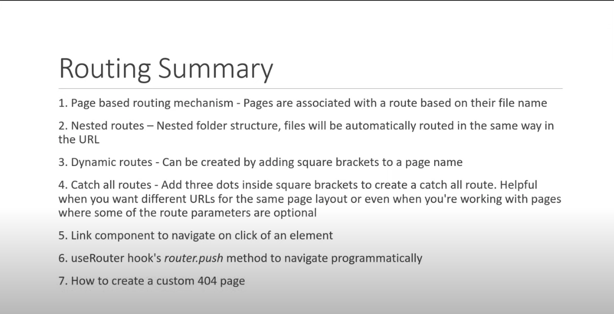

# File Based Routing/Page Based Routing

## Scenario_1

- Delete the `index.js` file that comes with NextJS and create your own `index.js` file.
- Create a function that returns a JSX
- Export the function. It will automatically be rendered at the `/`.
- Why? because any `index` file at the root directory(pages folder) will be rendered at the "/" route.
- To avoid conflicts it is best to only have one index named file in the root directory
- Remember, every file named `index` within a folder in pages will also be rendered first at the route of the folder name

## Scenario_2

- Create `about.js` file. create and export a function that returns a JSX
- Go To `/about` route and youll find your JSX rendered over there.
- Why? because NEXT automatically picks up a `.js, .ts, .jsx, .tsx` file extension and renders the content of the file using the file name as the route. So `about.js` maps to `/about`

## Scenario_3: Nested Routing

- Create a folder `blog`. inside it create two files `first.js` and `second.js`.
- Create and export functions that returns a JSX. Navigate to `/blog/first` and `/blog/second`
- Your JSX for each file will be rendered there respectively.
- Viola, Nested routing. Remember the name of the folder becomes the parent route and the file within becomes the actual route you want to visit

## Scenario_4: Dynamic Route Segment

- Create a `product` folder. create an `index.js`.
- Assume you have 30 products to render and index.js just lists all the products, what happens when you want to view each product?
- Will you follow the previous methods discussed and create 1-30 .js files? Surely there has to be a less monotonous way of doing this?
- There is! create a file with a special file name, `[productId].js` will be your file name. within it define and export your function that will return a JSX. now when you navigate to `/product/1` you will be served your html. But how?
- NEXT will treat a file name enclosed within squared brackets`[]` as a Dynamic Segment, this means when you navigate there with any integer or string you will be served the html define within the file. `/product/200`, `/products/boom`, etc all will work
- All this is rather rudimentary, you would typically want to extract the id from the url in order to perform some actions withit, so how do we do this?
- We import a hook called `useRouter` from `next/router`.
- Like in React, within the function, about the return statement, we create a constant, call the useRouter() function and pass it to the constant: `const router = useRouter()`
- create a constant and get the parameter you want from the query string of the router: `const productId = router.query.productId`
- It is worth noting that the parameter you retrieve from the query string must match the name within the square bracket(the name of the file).
- Also, although there is a dynamic route segment within a folder, when you define a static route with a certin name and you navigate to that route, the html from the static file will always be rendered. `/products/sweater` is a dynamic route, then you create a file named sweater inside products, when you navigate back to your route, the html from the static folder will take over and be rendered.
- Because NEXT is smart enough to first match specific filenames and there are no matches then it renders the content of the dynamic segment file.

## Scenario_5: Nested Dynamic Route Segment

- Assume you want to go to this route `product/1/review/1`, how would you do this? Nested Dynamic Route Segment to the rescue
- Just create a folder with the name of the folder in square brackets. Create an index.js file copy the content of `[productId].js` into the file and delete `[productId].js`. Dont worry, everything will continue to run well because the folder name is in square brackets and NEXT will map the folder name to the index.js file within it and then map them both to the route of the same folder name.
- Now you can create a folder within your Dynamic Route folder called `review` and a filename within []. `[productId]/review/[reviewId].js`
- Define your JSX, export and navigate to the route for your html.

## Scenario_6: Catch All Routes

- Catch All routes will catch all routes and map it to one file segment.
- `docs/feature1`, `docs/feature1/concept1`, etc will all display the content of the `[...params].js` file.
- This file is different from the Nested Dynamic Route Segments because:
  - with this one all route will display the same html unlike with the NDRS
  - with the NDRS you have to manually create the folders and/or files before you can navigate to deep routes(`/a/b/c`) but with this one all deep routes will be rendered without creating files/folders for them.
- This is very useful for sites where you want to define the html once but display multiple various of the page with very minor tweaks depending on the route
- Also the base route is the folder name, without the folder name, within which the Catch-All route file exists, the route will throw a 404. `docs/./././`
- When you navigate to `/docs` youll get a 404 error because NEXT hasn't included the folder name itself as an independent route, it alsways has to have some other route attached in order to render, example `docs/some_route`. In order to make NEXT render the same content for the root directory route `docs` simple change the file name from `[...params].js` to `[[...params]].js`.

# Links in NextJs

- To create a link to other pages, `import Link from "next/link"`. Then wrap the name of the page within the Link tags and specify the href to the relative url of the page: `<Link href="/blog">Blog</Link>`

# Custom 404 Pages

- To create a custom 404 page, simply create a file named `404.js` and define the content that will be rendered when a user hits a 404

# Recap

- 
- [Link to Tutorial](https://www.youtube.com/watch?v=TaDGyvh2Ud0&list=PLC3y8-rFHvwgC9mj0qv972IO5DmD-H0ZH&index=13)
